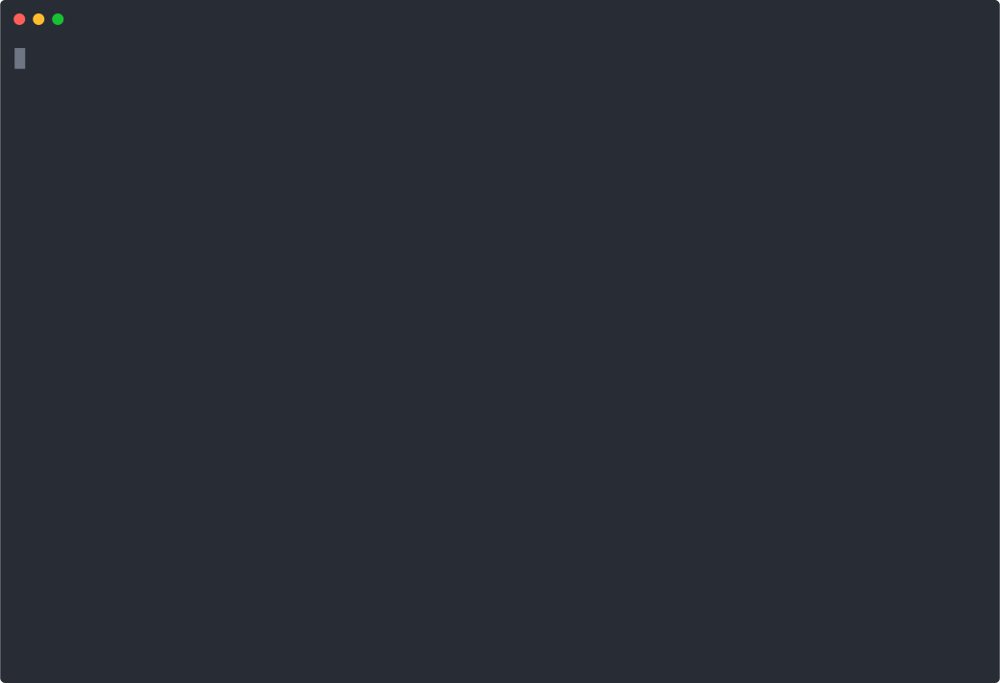

# <a id="0"></a>letsencrypt-docker-compose

- [Overview](#1)
- [Initial setup](#2)
  - [Prerequisites](#2-1)
  - [Step 1 - Create DNS records](#2-2)
  - [Step 2 - Copy static content or define upstream service](#2-3)
    - [Static content](#2-3-1)
    - [Reverse proxy](#2-3-2)
      - [Single Docker Compose project](#2-3-2-1)
      - [Multiple Docker Compose projects](#2-3-2-2)
  - [Step 3 - Perform an initial setup using the CLI tool](#2-4)
  - [Step 4 - Start the services](#2-5)
  - [Step 5 - Verify that HTTPS works with the test certificates](#2-6)
  - [Step 6 - Switch to a Let's Encrypt production environment](#2-7)
  - [Step 7 - Verify that HTTPS works with the production certificates](#2-8)
- [Adding new domains without downtime](#3)
  - [Step 1 - Create new DNS records](#3-1)
  - [Step 2 - Copy static content or define upstream service](#3-2)
  - [Step 3 - Update the configuration using the CLI tool](#3-3)
  - [Step 4 - Verify that HTTPS works](#3-4)
- [Removing existing domains without downtime](#4)
- [Manually renewing all Let's Encrypt certificates](#5)
- [Running on a local machine not directed to by DNS records](#6)
  - [Step 1 - Perform an initial setup using the CLI tool](#6-1)
  - [Step 2 - Start the services in dry run mode](#6-2)
- [Advanced Nginx configuration](#7)
- [Running Docker containers as a non-root user](#8)
- [SSL configuration for A+ rating](#9)

<!-- Table of contents is made with https://github.com/evgeniy-khist/markdown-toc -->

## <a id="1"></a>Overview

Nginx and Let’s Encrypt with Docker Compose in less than 3 minutes.

This example automatically obtains and renews [Let's Encrypt](https://letsencrypt.org/) free SSL/TLS certificates and sets up HTTPS in Nginx for multiple domain names using Docker Compose.

You can run Nginx and set up HTTPS (`https://`) and WebSocket Secure (`wss://`) with Let's Encrypt TLS certificates for your domain names and get an A+ rating in [SSL Labs SSL Server Test](https://www.ssllabs.com/ssltest/) using Docker Compose and _letsencrypt-docker-compose_ interactive CLI tool.
Nginx is configured to support IPv4, IPv6, HTTP/1.1, HTTP/2, and optionally, WebSocket.

Let's Encrypt is a certificate authority that provides free X.509 certificates for TLS encryption.
The certificates are valid for 90 days and can be renewed. Both initial creation and renewal can be automated using [Certbot](https://certbot.eff.org/).

When using Kubernetes Let's Encrypt TLS certificates can be easily obtained and installed using cloud native certificate management solutions.
For simple websites and applications, Kubernetes is too much overhead and Docker Compose is more suitable.
But for Docker Compose there is no such popular and robust tool for TLS certificate management.

The project supports separate TLS certificates for multiple domain names.

The idea is simple. There are three main services:

- `nginx`,
- `certbot` for obtaining and renewing certificates,
- `cron` for triggering certificates renewal,

and one additional service `cli` for interactive configuration.

The sequence of actions:

1. You perform an initial setup with _letsencrypt-docker-compose_ CLI tool.
2. Nginx generates self-signed "dummy" certificates to pass ACME challenge for obtaining Let's Encrypt certificates.
3. Certbot waits for Nginx to become ready and obtains certificates.
4. Cron triggers Certbot to try to renew certificates and Nginx to reload configuration daily.

[Back to top](#0)

## <a id="2"></a>Initial setup

### <a id="2-1"></a>Prerequisites

1. [Docker](https://docs.docker.com/install/) and [Docker Compose](https://docs.docker.com/compose/install/) are installed
2. You have a domain name
3. You have a server with a publicly routable IP address
4. You have cloned this repository (or created and cloned a [fork](https://github.com/evgeniy-khist/letsencrypt-docker-compose/fork)):
   ```bash
   git clone https://github.com/evgeniy-khist/letsencrypt-docker-compose.git
   ```

### <a id="2-2"></a>Step 1 - Create DNS records

For simplicity, this example deals with domain names `a.evgeniy-khyst.com` and `b.evgeniy-khyst.com`,
but in reality, domain names can be any (e.g., `example.com`, `anotherdomain.net`).

For all domain names create DNS A or AAAA record, or both to point to a server where Docker containers will be running.
Also, create CNAME records for the `www` subdomains if needed.

**DNS records**

| Type  | Hostname                  | Value                                |
| ----- | ------------------------- | ------------------------------------ |
| A     | `a.evgeniy-khyst.com`     | directs to IPv4 address              |
| A     | `b.evgeniy-khyst.com`     | directs to IPv4 address              |
| AAAA  | `a.evgeniy-khyst.com`     | directs to IPv6 address              |
| AAAA  | `b.evgeniy-khyst.com`     | directs to IPv6 address              |
| CNAME | `www.a.evgeniy-khyst.com` | is an alias of `a.evgeniy-khyst.com` |
| CNAME | `www.a.evgeniy-khyst.com` | is an alias of `a.evgeniy-khyst.com` |

### <a id="2-3"></a>Step 2 - Copy static content or define upstream service

Nginx can be configured

- to serve static content,
- as a reverse proxy (e.g., proxying all requests to a backend server).

#### <a id="2-3-1"></a>Static content

Copy your static content to `html/${domain}` directory.

```bash
cp -R ./examples/html/ ./html/a.evgeniy-khyst.com
```

#### <a id="2-3-2"></a>Reverse proxy

##### <a id="2-3-2-1"></a>Single Docker Compose project

The [`docker-compose.yml`](docker-compose.yml) contains the `example-backend` service.
It's a simple Node.js web app listening on port 8080.
It has `/hello?name={name}` REST endpoint and WebSocket echo server sending back the request sent by the client.

Replace it with your backend service or remove it.

```yaml
services:
  example-backend:
    build: ./examples/nodejs-backend
    image: evgeniy-khyst/expressjs-helloworld
    restart: unless-stopped
```

##### <a id="2-3-2-2"></a>Multiple Docker Compose projects

If your upstream server is defined in the YAML file of another Docker Compose project,
configure it to join the `letsencrypt-docker-compose_default` network created by this project,
so Nginx is able to forward requests to the upstream service.

Define a reference to the `letsencrypt-docker-compose_default` network in your other YAML file.

```yaml
version: "3"

services:
  example-backend:
    build: ./examples/nodejs-backend
    image: evgeniy-khyst/expressjs-helloworld
    networks:
      - letsencrypt-docker-compose
    restart: unless-stopped

networks:
  letsencrypt-docker-compose:
    name: letsencrypt-docker-compose_default
    external: true
```

### <a id="2-4"></a>Step 3 - Perform an initial setup using the CLI tool

Run the CLI tool and follow the instructions to perform an initial setup.

```bash
./cli.sh config
```

or

```bash
docker compose run --rm cli
```

On the first run, choose to obtain a test certificate from a Let's Encrypt staging server.
We will switch to a Let's Encrypt production environment after verifying that HTTPS is working with the test certificate.



### <a id="2-5"></a>Step 4 - Start the services

If you've made any changes to the Docker images, rebuild the services.

```bash
./cli.sh build
```

or

```bash
docker compose build
```

Start the services.

```bash
./cli.sh up
```

or

```bash
docker compose up -d
```

All Docker images used in the project are multi-platform and support `amd64`, `arm32v6`, and `arm64v8` architectures.
For example, when running the project on an `x86_64`/`amd64` machine, the `amd64` variants are pulled and run.

Check the logs.

```bash
docker compose logs -f
```

For each domain wait for the following log messages:

```
Switching Nginx to use Let's Encrypt certificate
Reloading Nginx configuration
```

### <a id="2-6"></a>Step 5 - Verify that HTTPS works with the test certificates

For each domain, check `https://${domain}` and `https://www.${domain}` if you've configured the `www` subdomain.
Certificates issued by `(STAGING) Let's Encrypt` are considered not secure by browsers and cURL.

```bash
curl --insecure https://a.evgeniy-khyst.com
curl --insecure https://www.a.evgeniy-khyst.com
curl --insecure https://b.evgeniy-khyst.com/hello?name=Eugene
curl --insecure https://www.b.evgeniy-khyst.com/hello?name=Eugene
```

If you've set up WebSocket, check it using the [wscat](https://github.com/websockets/wscat) tool.

```bash
wscat --no-check --connect wss://b.evgeniy-khyst.com/echo
```

### <a id="2-7"></a>Step 6 - Switch to a Let's Encrypt production environment

Run the CLI tool, choose `Switch to a Let's Encrypt production environment` and follow the instructions.

```bash
./cli.sh config
```

or

```bash
docker compose run --rm cli
```


### <a id="2-8"></a>Step 7 - Verify that HTTPS works with the production certificates

For each domain, check `https://${domain}` and `https://www.${domain}` if you've configured the `www` subdomain.
Certificates issued by `Let's Encrypt` are considered secure by browsers and cURL.

```bash
curl https://a.evgeniy-khyst.com
curl https://www.a.evgeniy-khyst.com
curl https://b.evgeniy-khyst.com/hello?name=Eugene
curl https://www.b.evgeniy-khyst.com/hello?name=Eugene
```

If you've set up WebSocket, check it using the [wscat](https://github.com/websockets/wscat) tool.

```bash
wscat --connect wss://b.evgeniy-khyst.com/echo
```

Optionally check your domains with [SSL Labs SSL Server Test](https://www.ssllabs.com/ssltest/) and review the SSL Reports.

The `cron` service will automatically renew the Let's Encrypt production certificates when the time comes.

[Back to top](#0)

## <a id="3"></a>Adding new domains without downtime

### <a id="3-1"></a>Step 1 - Create new DNS records

Create DNS A or AAAA record, or both.
Also, create CNAME record for `www` subdomain if needed.

**DNS records**

| Type  | Hostname                  | Value                                |
| ----- | ------------------------- | ------------------------------------ |
| A     | `c.evgeniy-khyst.com`     | directs to IPv4 address              |
| AAAA  | `c.evgeniy-khyst.com`     | directs to IPv6 address              |
| CNAME | `www.c.evgeniy-khyst.com` | is an alias of `c.evgeniy-khyst.com` |

### <a id="3-2"></a>Step 2 - Copy static content or define upstream service

Repeat the actions described in [the subsection of the same name in the "Initial setup" section](#2-3).

### <a id="3-3"></a>Step 3 - Update the configuration using the CLI tool

Run the CLI tool, choose `Add new domains` and follow the instructions.

```bash
./cli.sh config
```

or

```bash
docker compose run --rm cli
```

### <a id="3-4"></a>Step 4 - Verify that HTTPS works

For each new domain, check `https://${domain}` and `https://www.${domain}` if you've configured the `www` subdomain.

[Back to top](#0)

## <a id="4"></a>Removing existing domains without downtime

Run the CLI tool, choose `Remove existing domains` and follow the instructions.

```bash
./cli.sh config
```

or

```bash
docker compose run --rm cli
```

[Back to top](#0)

## <a id="5"></a>Manually renewing all Let's Encrypt certificates

You can manually renew all of your certificates.

Certbot renewal will be executed with `--force-renewal` flag that causes the expiration time of the certificates to be ignored when considering renewal, and attempts to renew each and every installed certificate regardless of its age.

This operation is not appropriate to run daily because each certificate will be renewed every day, which will quickly run into the Let's Encrypt rate limit.

Run the CLI tool, choose `Manually renew all Let's Encrypt certificates (force renewal)` and follow the instructions.

```bash
./cli.sh config
```

or

```bash
docker compose run --rm cli
```

[Back to top](#0)

## <a id="6"></a>Running on a local machine not directed to by DNS records

Running Certbot on a local machine not directed to by DNS records makes no sense
because Let’s Encrypt servers will fail to validate that you control the domain names in the certificate.

But it may be useful to run all services locally with disabled Certbot.
It is possible in dry run mode.

### <a id="6-1"></a>Step 1 - Perform an initial setup using the CLI tool

```bash
./cli.sh config
```

or

```bash
docker compose run --rm cli
```

### <a id="6-2"></a>Step 2 - Start the services in dry run mode

```bash
./cli.sh up --dry-run
```

Alternatively, you can enable dry run mode using the environment variable `DRY_RUN=true`.

```bash
DRY_RUN=true docker compose up -d
```

[Back to top](#0)

## <a id="7"></a>Advanced Nginx configuration

You can configure Nginx by manually editing the `nginx-conf/nginx.conf`.

Configure virtual hosts (`server` blocks) by editing the `nginx-conf/conf.d/${domain}.conf`.

Any `.conf` file from the `nginx-conf/conf.d` directory is included in the Nginx configuration.

For example, to declare upstream servers, edit `nginx-conf/conf.d/upstreams.conf`

```
upstream backend {
    server backend1.example.com:8080;
    server backend2.example.com:8080;
}
```

After editing the Nginx configuration, do a hot reload of the Nginx configuration.
Run the CLI tool and choose `Reload Nginx configuration without downtime`.

```bash
./cli.sh config
```

or

```bash
docker compose run --rm cli
```

Manual edits of the `nginx-conf/nginx.conf` and `nginx-conf/conf.d/${domain}.conf` are lost after running the CLI tool
(e.g., adding or removing domains or switching to a Let's Encrypt production environment).

The CLI tool generates the Nginx configuration files based on the `config.json`.
To make Nginx configuration changes persistent, also edit the Handlebars templates used for their generation

- [`templates/nginx.conf.hbs`](templates/nginx.conf.hbs),
- [`templates/servers.conf.hbs`](templates/servers.conf.hbs).

To add domain-specific configuration to a template use the [`ifEquals` Handlebars helper](cli/src/handlebars-helpers.js).

```hbs
{{#ifEquals domain "a.evgeniy-khyst.com"}}
  # Configuration for a specific domain
{{/ifEquals}}
```

[Back to top](#0)

## <a id="8"></a>Running Docker containers as a non-root user

By default, Docker is only accessible with root privileges (`sudo`).

The CLI tool creates the following files in the hosts' project root directory mounted into the container:

- `config.json`,
- `nginx-conf/nginx.conf`,
- `nginx-conf/conf.d/${domain}.conf`.

These files will be owned by the `root` user.
When non-root users try to clean up or edit these files, they get the "permission denied" error.

If you want to use Docker as a regular user, you need to [add your user to the `docker` group](https://docs.docker.com/engine/install/linux-postinstall/#manage-docker-as-a-non-root-user).

To make the CLI tool create files in a way that allows non-root users to edit and delete them,
tell Docker Compose to run as the current user instead of `root`.

As the CLI tool runs Docker Compose commands internally, specify the `docker` group as a supplementary group,
so the user inside the container will be its member.

We have to use user IDs and group IDs because containers don't know their associated usernames and group names.

Run the CLI tool specifying the current user and `docker` group to make it create files owned by the current user.

```bash
CURRENT_USER="$(id -u):$(id -g)" DOCKER_GROUP="$(getent group docker | cut -d: -f3)" docker compose run --rm cli
```

The convenience script `cli.sh` runs the CLI tool as the current user by default.

```bash
./cli.sh config
```

You can run the CLI tool as UID/GID 0 instead of the current user with the option `--no-current-user`.

```bash
./cli.sh config --no-current-user
```

[Back to top](#0)

## <a id="9"></a>SSL configuration for A+ rating

SSL in Nginx is configured accoring to best practices to get A+ rating in [SSL Labs SSL Server Test](https://www.ssllabs.com/ssltest/).

Read more about the best practices and rating:

- https://github.com/ssllabs/research/wiki/SSL-and-TLS-Deployment-Best-Practices
- https://github.com/ssllabs/research/wiki/SSL-Server-Rating-Guide

[Back to top](#0)
